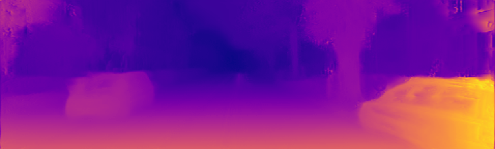
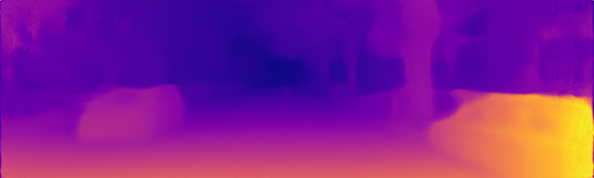
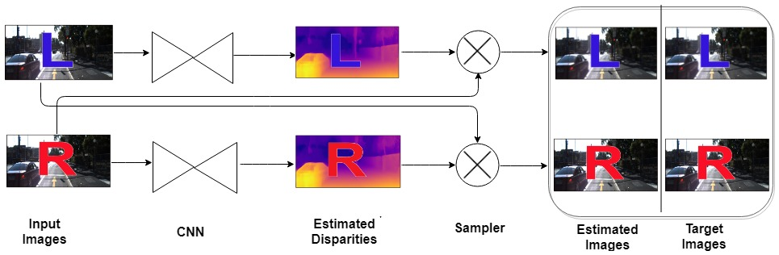
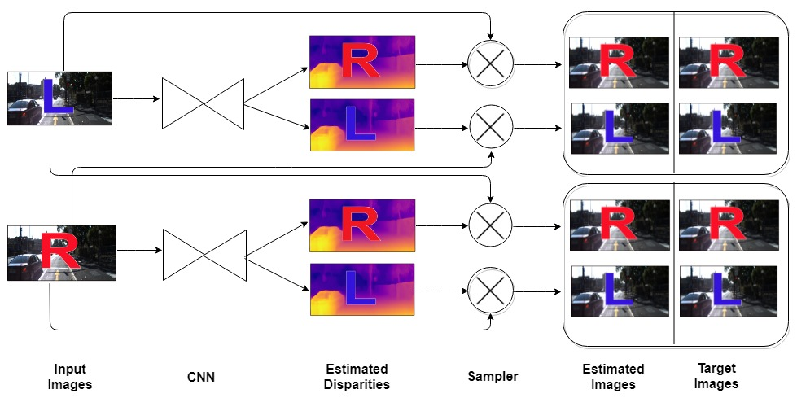

# Dual CNN Approach For Depth Estimation 
 **Abstract**:
  The objective of this work is to estimate the depth map that has the information about how far the camera captured the scene. A lot of progress has been made to solve the depth estimation problem in stereo vision. Though, a very satisfactory performance is observed by utilizing the deep learning in supervised manner for depth estimation. This approach needs huge amount of ground truth training data as well as depth maps which is very laborious to prepare and many times it is not available in real scenario. Thus, the unsupervised depth estimation is the recent trend by utilizing the binocular stereo images to get rid of depth map ground truth. In unsupervised depth computation, the disparity images are generated by training the CNN with an image reconstruction loss based on the epipolar geometry constraints. The effective way of using CNN as well as investigating the better losses for the said problem needs to be addressed. In this, auto encoder algorithm based dual CNN based model is presented for unsupervised depth estimation with 6 losses (DNM6) with individual CNN for each view to generate the corresponding disparity map. The proposed dual CNN model is also extended with 12 losses (DNM12) by utilizing the cross disparities. The presented DNM6 and DNM12 models are tested over KITTI driving database and compared with the recent state-of-the-art result of unsupervised depth estimation.
 
**Sample Input Image** : 

  

**Depth Image using DNM6 Model** :

  

**Depth Image using DNM12 Model** :

  

**For more details,** you can look into the paper [here](https://arxiv.org/pdf/1804.06324.pdf).

# Requirements :
Tensorflow 3.0
CUDA 8.0 and
Ubuntu
  
   This network is implemented in TensorFlow contains 62 million trainable parameters which include weights and biases and trained in NVIDIA Tesla K80 24GB GDDR5 GPU server up to 50 epochs which takes 49 hours.
   
# Models :
Developed the 2 models involving 2 CNNs named 'Dual CNN' for estimating the depth map.

**Model-1:  Dual Network Model with 6 losses (DNM6)** 

  

**Model-2:  Dual Network Model with 12 losses (DNM12)**

  

